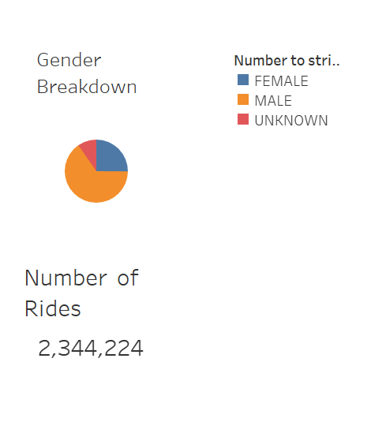
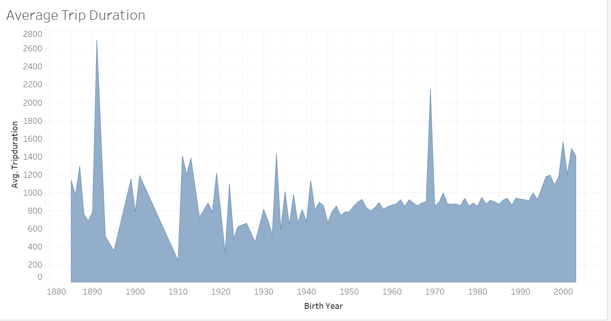
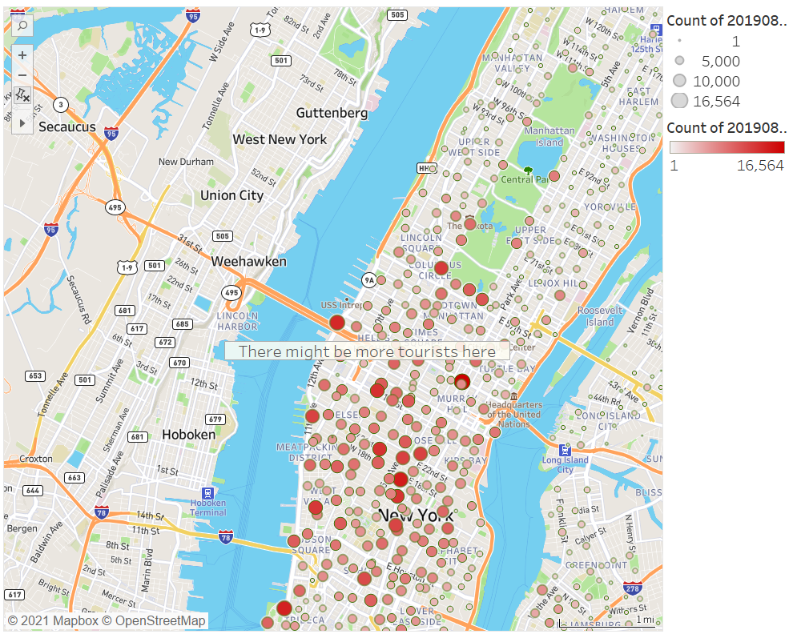
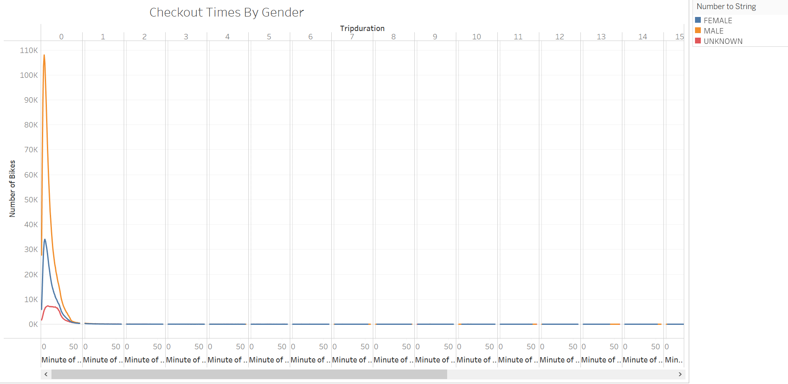
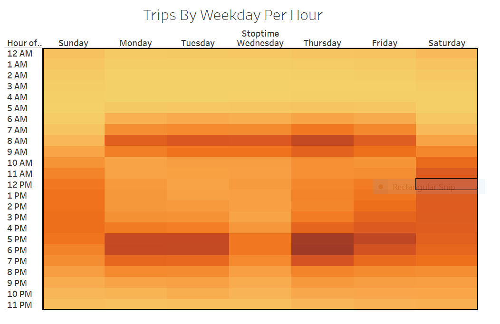
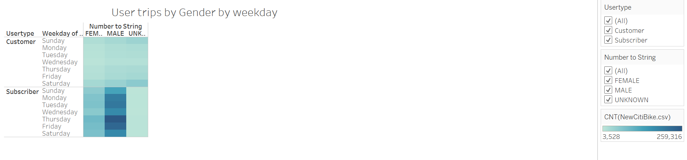

# bikesharing
## Overview of this statistical analysis
## Purpose
This analysis was conducted on New York City bike sharing program   to understand how it works , based on which a business proposal was created to be pitched to  the key stakeholders for the sole purpose of starting a Bike sharing program in the city of Des Moines.
Tableau has been used to create visualisations for this analysis.
August month has been used to study various factors as it is one of the busiest months of summer for tourists.
Different visualisations  below show features such as ,the length of time bikes are checked out for all riders genders and each user type for each hour and each day of the week etc.

## RESULTS 
The below viz shows the proportion of riders in terms of gender and Total number of riders for the August month

Here is a snapshot of the average trip duration of users

The following shows a snapshot of top starting locations in Manhattan

The checkout times by gender shows us , male renting bikes is way more than other genders

In the following image we can Understand how many trips by weekday per hour look like , which displays around 7-8 am and 5-6pm are busy and Thursday seems to be more busy than other days .

The Following displays User trips by gender and type of user by weekday!

## SUMMARY
The checkout times for user is highest during the 0th  the hour , this can be noted to be busiest to Provide services
Males checkout are the highest , and subscribers are more than customers.
The business can focus on 3 ideas
Maintain more Male style bike stock
Market to get more subscribers
And
Have more staff during busy hours like 7-8 am and busy days like Thursday  to provide all needs and services and requirements to make sure  busy times are handled to avoid problems
